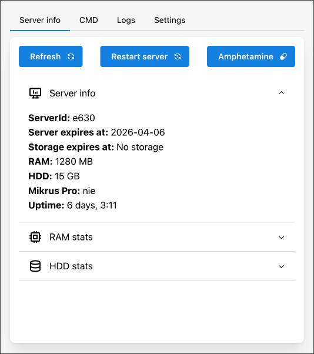
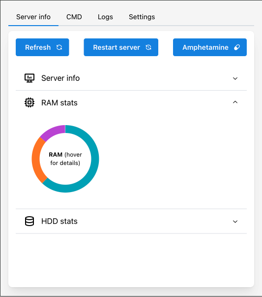

# Mikrus Buddy

## Introduction

**Mikrus Buddy** is an open-source browser extension designed for the [Mikrus](https://mikr.us/) community. This extension leverages the Mikr.us API to display vital information about your Mikrus VPS directly in your browser. [Install from chrome webstore](todo/link/to/extension/page)

<div style="display: flex; justify-content: space-between;">
   
   
</div>

## Features

- **VPS Information**: view detailed information about your VPS
  - server id
  - expiration date (both server and storage)
  - RAM and HDD size
  - Mikrus Pro status
  - uptime
  - Detailed RAM and HDD stats
- **Server Management**:
  - restart your server with a single click
  - apply "amphetamine" to boost your RAM
- **i18n**: based on browser language. Supports:
  - Polish
  - English

## Usage

Currently, the extension is available in the Chrome Web store only. Feel free to install it and rate [here](TODO).
All, you need to do next is to provide your API key and server ID. Both can be obtained from your [mikr.us admin panel](https://mikr.us/panel/?a=api).

> [!TIP]
> If you want to use this extension in a different browser, you need to build it by your own. See [Building for different browsers](#building-for-different-browsers) for details

## Permissions & API key safety

This extension needs just two permissions:

- **storage** - for storing user-entered data in the browser (API key, server ID)
- **https://api.mikr.us host permission** - for making request to the official [mikr.us API](https://api.mikr.us/)

## Roadmap

Look at the [kanban board](https://github.com/users/iskrzycki/projects/1) to see, what features are planned in the future.

### Prerequisites

- Node.js
- npm

### Development

1. Clone the repository:

   ```sh
   git clone https://github.com/iskrzycki/mikr.us-buddy.git
   cd mikr.us-buddy
   ```

2. Install dependencies:

   ```sh
   npm install
   ```

3. Running in a dev mode

   ```sh
   npm run dev
   ```

### Building for different browsers

1. Build dist:

   ```sh
   # chrome
   npm run build
   # firefox
   npm run build:firefox
   ```

2. Create a zip bundle

   ```sh
   # chrome
   npm run zip
   # firefox
   npm run zip:firefox
   ```

3. Next, just load the extension bundle to your browser.

Different browser? Look at [this guide](https://wxt.dev/guide/essentials/target-different-browsers.html) for details.

## License

This project is licensed under the MIT License.

## Contact

For any questions or suggestions, feel free to open an issue or contact me at [iskrzycki@gmail.com](mailto:iskrzycki@gmail.com). If you find this project useful and would like to support its development, consider buying me a coffee.

 <a href="https://buycoffee.to/iskrzycki">
 
 </a>
